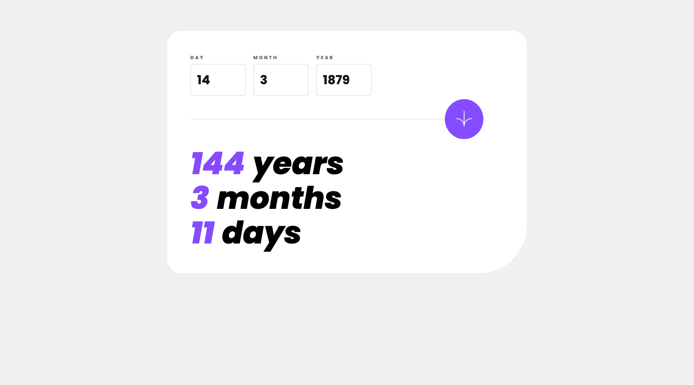
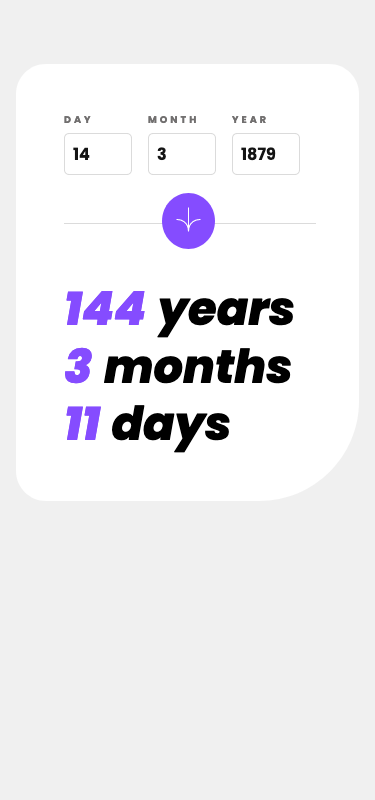

# Frontend Mentor - Age calculator app solution

This is my solution to the [Age calculator app challenge on Frontend Mentor](https://www.frontendmentor.io/challenges/age-calculator-app-dF9DFFpj-Q). Frontend Mentor challenges help you improve your coding skills by building realistic projects. 

## Table of contents

- [Overview](#overview)
  - [The challenge](#the-challenge)
  - [Screenshot](#screenshot)
  - [Links](#links)
- [My process](#my-process)
  - [Built with](#built-with)
- [Author](#author)
- [Acknowledgments](#acknowledgments)

## Overview

### The challenge

Users should be able to:

- View an age in years, months, and days after submitting a valid date through the form
- Receive validation errors if:
  - Any field is empty when the form is submitted
  - The day number is not between 1-31
  - The month number is not between 1-12
  - The year is in the future
  - The date is invalid e.g. 31/04/1991 (there are 30 days in April)
- View the optimal layout for the interface depending on their device's screen size
- See hover and focus states for all interactive elements on the page
- **Bonus**: See the age numbers animate to their final number when the form is submitted

### Screenshot

#### Desktop

#### Mobile

### Links

- Solution URL: https://www.frontendmentor.io/solutions/response-age-calculator-app-built-with-react-no-figma-file-5VkzJNcoxI
- Live Site URL: https://age-calc-app-aaf08a.netlify.app/

## My process

### Built with

- Semantic HTML5 markup
- CSS custom properties
- Flexbox
- Mobile-first workflow
- [React](https://reactjs.org/) - JS library

## Author

- Website - [Web Dev Portfolio](https://ananfito.github.io)
- Frontend Mentor - [@ananfito](https://www.frontendmentor.io/profile/ananfito)
- Mastodon - [@infinifito@hachyderm.io](https://hachyderm.io/@infinifito)
- Twitter - [@wordsbyfifi](https://www.twitter.com/wordsbyfifi)
